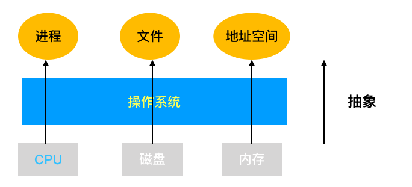
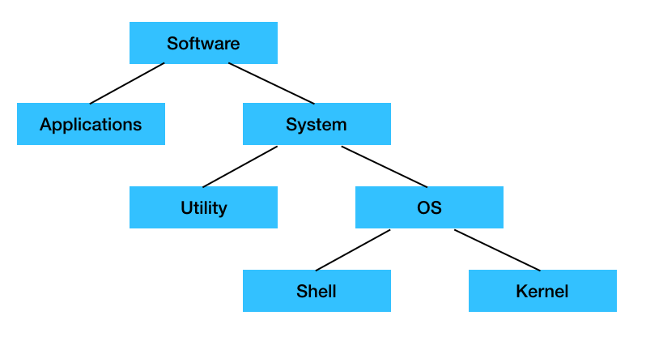
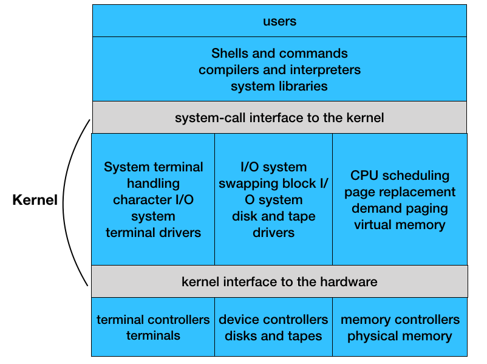
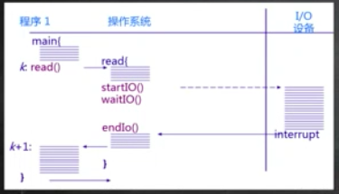
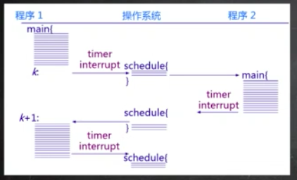
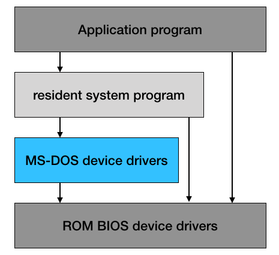
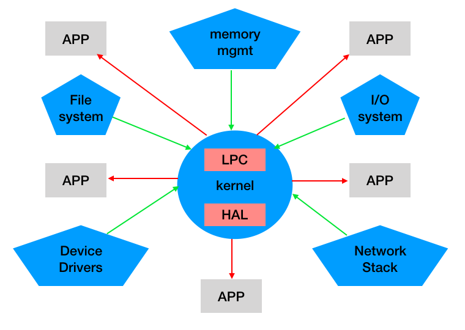

# 讲义 1
# 1.1 课程概述
+ 基本概念及原理
  - 操作系统介绍
  - 中断及系统调用
  - 内存管理
  - 进程及线程
  - 调度
  - 同步
  - 文件系统
  - I/O子系统
+ 练习
  - 在ucore操作系统上的实验
  - [github](https://github.com/chyyuu)
    1. 实验0： 准备
    2. 实验1： 系统启动及中断
    3. 实验2： 物理内存管理
    4. 实验3： 虚拟内存管理
    5. 实验4： 内核线程管理
    6. 试验5： 用户进程管理
    7. 实验6： CPU调度
    8. 实验7： 同步与互斥
    9. 实验8： 文件系统
+ 延伸
  - 讨论一些相关话题或故事

+ 预备知识
  - 计算机结构原理（Intel 80386+）
  - 数据结构
  - C和汇编语言
# 1.2 什么是操作系统
+ 没有一个完整，精确，公认的定义
+ 从功能和特点来介绍操纵系统
**（对上，对应用程序/用户，从控制角度，）**
  - 操作系统式一个控制软件
  - 管理应用程序
  - 为应用程序提供服务
  - 杀死应用程序
  
  例如： 在windows操作系统为各种桌面应用程序提供服务：
  
  
  
**（对下，硬件资源）**  
  - 资源管理
  - 管理外设，分配资源
  
  
+ 操作系统架层次结构（中间层系统软件）
  - 硬件之上
  - 应用程序之下
  
  
  
+ 操作系统在软件中的位置
  - 应用软件： 办公软件，视频播放软件
  - OS 位于应用软件之下，为应用软件提供服务支撑
  
  
  **utility**: 特定功能软件，如编译器，动态共享库。。。
  
  **OS**： 完成对硬件的控制和管理，更复杂繁琐
  
  - OS 分两部分
    1. Shell： 对外，面向应用程序，入linux，windows，android的GUI。
    2. kernel： 对内，管理硬件资源。（课程重点）
    
+ 硬件资源：三大块 ->  **kernel** os内部组件
  - CPU：CPU调度，进程，线程管理
  - Memory：物理内存管理，虚拟内存管理
  - 硬盘/disk：以磁盘块为基本单元，不容易直接操作->抽象出文件系统:文件系统管理
  - 其他：中断处理与设备驱动（底层硬件相关）
  
+ OS kernel的 特征 
  - 并发: 一段时间内运行多个程序（并行是一个时间点运行多个程序）
    <ul>
      <li>计算机系统中同时存在多个运行的程序<li>
        <ul>
          <li>需要OS管理和调度</li>
        </ul>
      <li>共享</li> 
          <ul>
          <li>同时共享</li>
            <li>互斥共享</li>
        </ul>
    <li>虚拟</li> 
          <ul>
          <li>利用躲到程序设计技术，让每个用户都觉得有一个计算机为他专门服务</li>
        </ul>
  <li>异步</li> 
          <ul>
          <li>程序的执行不是一贯到底，而是走走停停，向前推进的速度不可预知。</li>
            <li>但只要运行环境相同，OS需要保证程序运行的结果也相同。</li>
        </ul>
    </ul>
# 1.3 为什么学习操作系统？
+ 综合课程 - 结合许多不同的课程，大三大四的课
  - 程序设计语言（C...）
  - 数据结构
  - 算法
  - 计算机体系结构
  - 材料
  - 操作系统概念和原理，源代码
  - 技能
  - 操作系统的设计和实现
+ 已经有了很多OS
  - windows，linux。。。
+ 为什么要学习OS？
  - OS 还在不停的发展（因为硬件也在发展），在工控等领域有强烈的需求
  - OS 很酷，很有用，很有挑战。
  - 提升软件开发能力
  - OS： 计算机科学研究的基石之一
    1. 计算机系统的基本组成部分
    2. 由硬件的发展和应用需求所驱动
    3. 学术和工业的持续推进
  - 顶尖大学的计算机科学部门：MIT, 斯坦福
  - 工业界：
    1. 微软，谷歌，Facebook。。。
    2. 苹果： iphone。。。
  - 学术界
    1. ACM
    2. IEEE
    3. USENIX
    4. 国内 CCF
  - 顶级会议 （论文，PPT，VIDEOS 公开。。。）
    1. SOSP (奇数年)
    2. USENIX （偶数年）
  - 获奖论文（30余篇）
+ 操作系统挑战性
  - 操作系统很大： windows xp 45，000，000 行
    1. 目标是了解核心内容
  - 操作系统管理并发
    1. 导致有趣的编程挑战
  - OS 管理原始硬件
    1. 时间依赖行为，非法行为，硬件故障
  - OS 代码必须高效
    1. 低耗CPU, 内存， 磁盘。。。
  - OS 必须稳定
    1. OS 出错，意味着机器出错
  - OS 是系统安全的基础
+ OS 原理和概念不是OS的全部，并不是现在OS关注的重点
+ 由于硬件的进步，很多OS功能已经由硬件本身解决了，比如进程，I/O调度。。。（课本知识落后于产业界）

+ OS 需要权衡（balance）
  - 空间和时间
  - 性能和可预测性
  - 公平和性能
+ 硬件方面，OS需要关注硬件，需要系统性的平衡：
  - 良好的硬件管理
  - 合理的资源分配
      1. 硬盘速度和CPU，内存相差很多，OS需要协调处理。
# 1.4 如何学习操作系统
+ 我听到的我会忘记
+ 我看到的我会记住
+ 只有我做过的我才能理解
# 1.5 操作系统实例
+ UNIX 家族 （ BSD(伯克利软件发行版) ）
  - Open source
    1. FreeBSD
    2. openBSD
    3. NetBSD
  - 商业
    1. solaris
    2. hp
    3. ios
+ Linux家族： 在服务器和终端占统治地位
  - redhat
  - ubuntu
  - suse
  - debian
  - fedoro
  - 服务器
  - 智能终端: android。。。
+ Windows 家族
  - 桌面： 占统治地位
  - 服务器
  - 终端
+ 其他

# 1.6 操作系统历史
**从1981年到2012年计算机系统的变化**（需要一张图表）
+ 早期计算机使用纸带传输程序和数据，OS只起到加载作用 

+ CPU等硬件快速发展，计算机速度得到提升，性能未得到充分利用 -> 批处理，并发特征，OS雏形, 

+ 内存的容量越来越大，CPU执行多个程序，多道程序设计
  - 内存中可存放多个程序，而不用每次都重新导入
  - 当时CPU昂贵，多人使用
  - 中断
  - 缺点是交互性差，不需要人得参与（无法调试，无法输入命令）

+ 为了更好的利用计算机资源，并且更好的与用户交互，提出分时系统

+ 个人电脑系统（由于硬件发展）
  - 单用户
  - 利用率不再是关注点
  - 重点是用户界面和API
  - 很多服务和功能不存在
  - 最初OS作为一个简单的服务提供者（简单库）
  - 现在支持协调和沟通的多应用程序
  - 越来越多的安全问题（电子商务，医疗记录）
  
+ 未来
  - 多核多处理器
  - 网络发展导致分布式操作系统
    1. 松，紧耦合系统。（用户与数据中心为松，数据中心为紧，共同努力完成用户任务）
    2. 云计算
  - 总结： 一群人围着一个计算机请求服务，编程许多计算机为一个人服务
  
# 1.7 OS 结构
+ 简单操作系统： MS-DOS（1981-1994）
  - 部分模块的单体内核（汇编语言，功能比较弱，没有保护，易被攻击破坏, 很难扩展）
  - 硬件： 64K - 1M
  
  

+ Unix: 
  - 1972由Kenneth Thompson 和 Dennis Ritchie在贝尔实验室设计
  - 用于当时小型机
  - C语言实现，具有可移植性。
  
  
+ uCore: 
  - 仿unix，linux， 麻雀虽小，五脏俱全
  - 微内核架构，尽可能把内核功能移到用户空间，谨防中断处理，消息传递等必须得
  - 服务之间用内核的消息传递来沟通，灵活，安全
  - 代价：性能，消息要由内核中转
  - 产业界中用的较少
  
  
+ 外核
  - 更极端，在学术界
  - 分为两部分， exokernel与硬件打交道 和 libOS（建立在exokernel之上）和应用程序打交道 （每个应用都有专门的libos）
  - 优点是速度，每个应用都有专门设计的libos
  - exokernel实现硬件隔离
+ VMs
  - 在一个物理计算机上实现多个虚拟的操作系统（实际上是多个虚拟计算机）
  - 一台计算机变为多台计算机 （CPU的发展，硬件资源过剩）
  
# 1.8 小节
  

  
