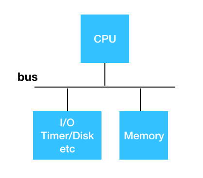
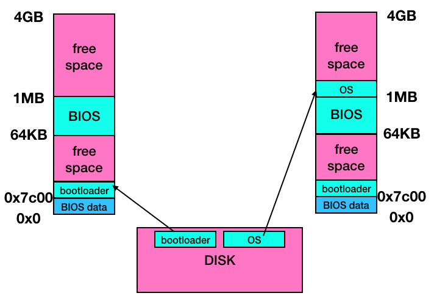
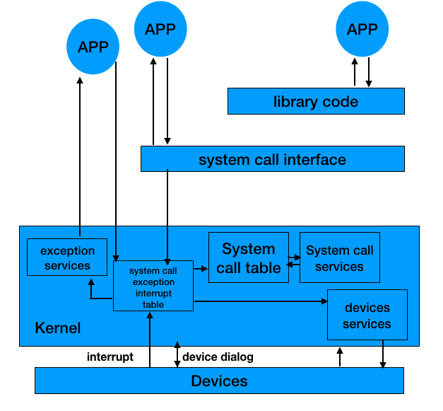

# Chapter 2
# 2.1 操作系统的启动，中断，异常和系统调用
+ 启动 
  - 计算机系统结构概述
    
  - 计算机的内存和硬盘布局
    + DISK: 存放OS
    + BIOS: 基本I/O处理系统 -> 开机检查外设
    + bootloader: 加载OS
    
  - 开机顺序：
  
    + POST(加电自检)：寻找显卡，键盘鼠标等初始化检查
    + BIOS将bootloader从磁盘的引导扇区（512字节）加载到0x7c00，跳转到CS:IP = 0000:0x7c00
    + bootloader将操作系统的代码和数据从磁盘加载到内存中
    + 将控制权交还OS，OS开始正常工作
        
    
+ 中断，异常和系统调用： OS与设备和程序交互
  - 背景
  - 三者相比较
  - 中断和异常处理机制
  - 系统调用的概念
  - 系统调用的实现
  - 程序调用和系统调用的不同之处
  - 开销
  
  - OS的interface有三个
    + 中断 面向 外设
    + 系统调用和异常 面向 用户程序
  - 定义
    + 系统调用
      - 来源于应用程序
      - 应用程序主动向操作系统发出服务请求
    + 异常
      - 来源于不良的应用程序
      - 非法指令或者其他坏的处理状态（如内存出错。。。）
    + 中断
      - 来源于外设
      - 来自不同的硬件设备的计时器和网络的中断
  - 为什么应用程序不直接访问外设？
    + 在计算机运行中，内核是被信任的
    + 只有内核可以执行特权指令（这两点是安全性考虑）
    + 为了方便应用程序，屏蔽底层硬件的复杂性和差异性（高效性）
  - OS 如何设计和实现中断，异常，和系统调用（以后章节）
  - 三者有何区别和特点
    + 源头：
      - 中断： 外设（键盘，网卡（网络包事件），声卡，显卡。。。）
      - 异常： 应用程序意想不到的行为 （除零，恶意程序访问别的程序的地址空间，资源得不到满足。。。）
      - 系统调用： 应用程序主动请求OS提供服务 （明确指令和参数，例如打开文件，发送网络包。。。）
    + 处理时间
      - 中断： 异步（OS不知道何时产生中断）
      - 异常： 同步（执行特定指令一定会产生）
      - 系统调用： 异步（有时候返回是异步的，比如应用程序请求系统调用之后去做别的事情）或同步（产生一定是同步，返回一般也是同步）
    + 响应
      - 中断： 持续，对应用程序是透明的（应用程序感觉不到中断）
      - 异常： 杀死或者重新执行意想不到的应用程序指令
      - 系统调用： 等待和持续
# 2.2 中断，异常和系统调用
+ 中断和异常的处理机制
  - 中断是外设的事件
  - 异常是内部cpu的事件
  - 中断和异常迫使cpu访问一些被中断和异常访问的功能
  - 处理过程分为硬件的处理过程和软件的处理过程
+ 中断处理
  - 硬件
    + **设置中断标记**（cpu初始化）
    + 将内部，外部事件设置中断标志 （哪个外设发生了中断）
    + 中断事件的ID（程序访问的中断向量地址） （保存与恢复机制）（用哪个终端服务例程处理）
  - 软件
    + 保存当前处理状态
    + 中断服务程序处理（根据中断时间）
    + 清除中断标志
    + 恢复之前保存的处理状态
+ 异常处理：异常编号
  - 保存现场
  - 异常处理
    + 杀死产生异常的程序
    + 重新执行异常指令
  - 恢复现场
+ 系统调用
  - 例如：应用程序调用 C标准库函数printf() 时，会触发系统调用write()，并返回成功或者失败标志 
  - 程序访问主要是通过高层次的API，而不是直接进行系统调用
    + win32 API 用于windows
    + POSIX API 用于 POSIX-based systems （包括UNIX,LINUX,MAC OS X的所有版本，跨平台）
    + Java API 用于 JAVA虚拟机（JVM）
  - 通常情况下，与每个系统调用相关的序号
    + 系统调用接口根据这些序号来维护表的索引
  - 系统调用接口调用内核态中预期的系统调用
    + 并返回系统调用的状态和其他任何返回值
  - 用户不需要知道系统调用是如何实现的
    + 只需要获取API和了解OS将什么作为返回值
    + OS接口的细节大部分都隐藏在API中
      - 通过运行程序支持的库赖管理（用包含编译器的库来创建函数集）
  - 用户态，内核态的转换
    + 调用system call会诱发内核态
    + 用户态： 不能使用特权指令和访问IO
    + 内核态： 可以执行任何指令，完全控制计算机系统
  - 系统调用与函数调用的区别
    + 函数调用在一个栈空间完成参数的传递和返回，不需要特权级转换
    + 系统调用中应用程序和内核程序拥有各自的堆栈，需要切换堆栈以及特权级转换（系统开销大，安全性提高）

+ 跨越OS边界的开销
  - 在执行时间上的开销超过程序调用
  - 开销：
    + 建立 中断、异常、系统调用 号与对应服务（例程映射关系的初始化开销）
    + 建立内核堆栈
    + 验证参数
    + 内核态映射到用户态的地址空间（更新页面映射权限）
    + 内核态独立空间地址（TLB）
