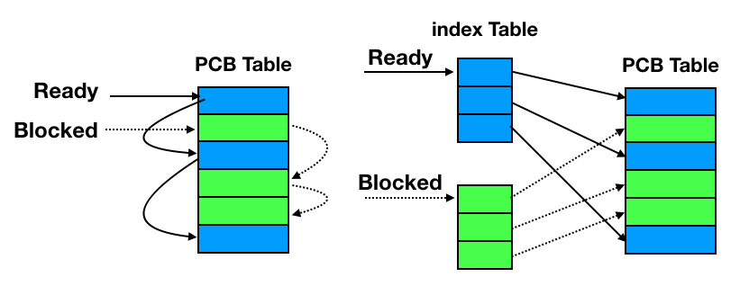
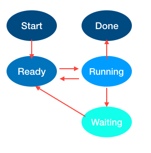
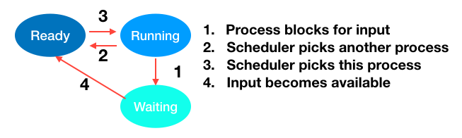
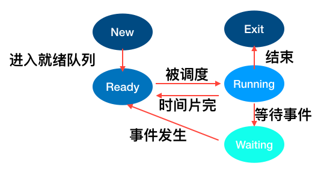
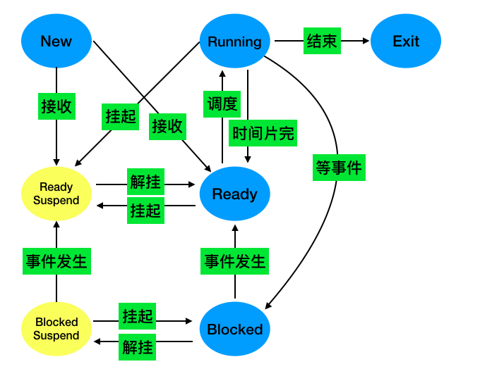
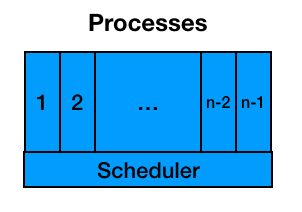
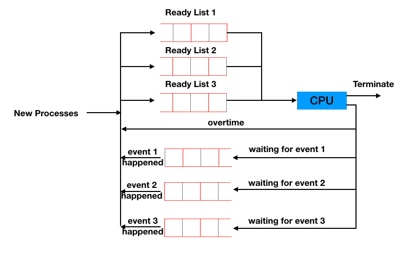
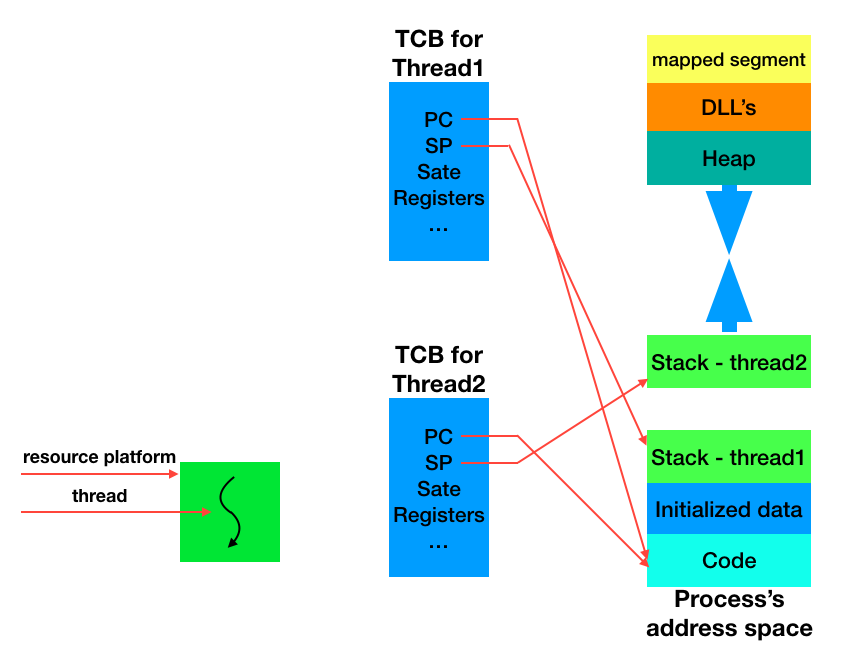
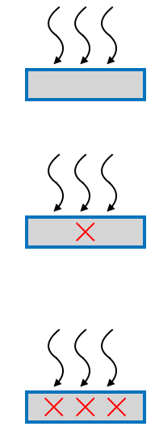
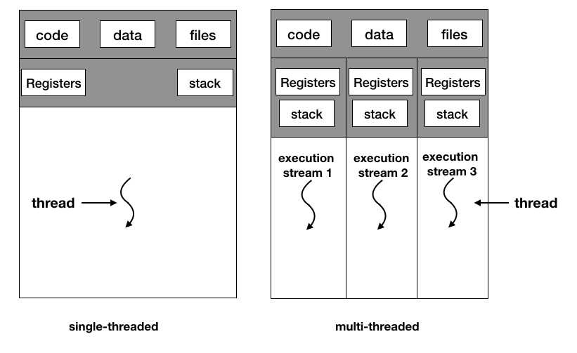

# 7.1 进程的定义
+ 进程（process）的描述
+ 进程的状态(status)
+ 线程(thread)
+ 进程间的通信（inter-process communication）
+ 死锁（deadlock）

## 进程的描述

+ 进程的定义
  - MAC 中使用activity monitor 查看进程
  - 为什么要使用进程？：随着硬件的发展，内存中可以放置多个运行的程序->进程
  - **进程**： 一个具有独立功能的程序在一个数据集合上的一次**动态**执行过程
  - 
+ 进程的组成
+ 进程的特点
+ 进程的控制结构

# 7.2 进程的组成
## 一个进程应该包括：
+ 程序的代码
+ 程序处理的数据
+ 程序计数器中的值，指示下一条将运行的指令
+ 一组通用的寄存器的当前值，堆、栈；
+ 一组系统资源（如打开的文件）
总之，进程包括了正在运行的一个程序的所有状态信息

## 进程与程序的关系
+ 程序是产生进程的基础
+ 程序的每次运行构成不同的进程
+ 进程是程序功能的体现
+ 通过多次执行，一个程序可以对应多个进程，
+ 通过调用关系，一个进程可以包括多个程序
**多对多**的复杂关系
## 进程与程序的区别
+ 进程是动态的，程序是静态的：
  - 程序是有序代码的集合
  - 进程是程序的执行，进程有核心态/用户态
  - 进程是暂时的，程序是永久的：进程是一个状态变化的过程，程序可以长久保存
  - 进程与程序的组成不同： 进程的组成包括程序、数据和进程控制块（即进程状态信息）
+ 类比1： 一个计算机科学家想给女儿做蛋糕，所以找了一本有关蛋糕的食谱，买了一些原料（面粉，鸡蛋，糖，香料。。。），然后边学边做
  - 食谱：程序
  - 你： cpu
  - 原料： 数据
  - 做蛋糕（的过程）： 进程
  这个时候儿子哭着跑进来，说手被蜜蜂蛰了。教授只好把蛋糕放在一边。他在食谱上做了个标记，把状态信息记录了下来。
  然后又去找了一本医疗手册，查到相关的内容，按照上面的指令一步步地执行。当伤口处理完了之后，又回到厨房继续做蛋糕。
  
  **CPU从一个进程（做蛋糕）切换到另一个进程（医疗救护）**
  
 # 7.3 进程的特点
 + 动态性： 可动态的创建，结束进程
 + 并发性： 进程可以被独立调度并占用处理机运行 
  - 并发： 一个时间段多个进程执行
  - 并行： 一个时间点多个进程执行
 + 独立性： 不同进程的工作不相互影响（内存管理：不同的进程分配不同的页表）
 + 制约性： 因访问共享数据/资源或进程间同步而产生制约
 
 
 + 程序 = 算法 + 数据结构
 + 描述进程的数据结构：进程控制块（Process Control Block,PCB）
 + 操作系统为每个进程都维护了一个PCB，用来保护与该进程有关的各种状态信息
 
 # 进程控制结构
 ## 进程控制块：
 + OS管理控制进程运行所用的信息集合
 + OS用PCB来描述进程的基本情况及运行变化的过程
 + PCB是进程存在的唯一标识
 
 ## 使用PCB
 + 进程的创建： 为该进程生成一个PCB
 + 进程的终止： 回收他的PCB
 + 进程的组织管理： 通过对PCB的组织管理来实现
 
 ## PCB包含三大类信息
 + 进程标识信息
  - 本进程的标识
  - 本进程的产生者（父进程）标志
  - 用户标识
 + 处理机状态信息保存区（保存进程的运行现场信息）
  - 用户可见寄存器（用户程序可以使用的数据，地址等寄存器）
  - 控制和状态寄存器（如程序计数器PC，程序状态字PSW）
  - 栈指针（过程调用、系统调用、中断处理和返回时需要用到它）
 + 进程控制信息
  - 调度和状态信息（用于OS调度进程并占用处理机使用）
  - 进程间通信信息（为支持进程间的与通信相关的各种标志，信号，信件等，这些信息存在接收方的PCB中）
  - 存储管理信息（包含有指向本进程影像存储空间的数据结构）
  - 进程所用资源（说明由进程打开，使用的系统资源，如打开的文件等）
  - 有关数据结构连接信息（进程可以连接到一个进程列队中，或者连接到相关的其他进程的PCB）
  
 ## PCB的组织方式
 + 链表： 同一状态的进程其PCB成一个链表，多个状态对应多个不同的链表
  - 就绪链表
  - 阻塞链表
  - 等等
 + 索引表（数组）：同一状态的进程归入一个index表（由index指向PCB），多个状态对应多个不同的index表
  - 就绪索引表
  - 阻塞索引表
  - 等等
  
  
# 7.5 进程的生命期管理
## 进程状态
+ 进程的生命周期管理
  - 进程创建（初始化PCB）
    + 引起进程创建的3个主要事件
      - 系统初始化时（init进程）
      - 用户请求创建一个新的进程
      - 正在运行的进程执行了创建进程的系统调用
  - 进程运行
    + kernel选择一个就绪态的进程，让它占用处理机并执行
    + 为何选择？
    + 如何选择？(进程调度)
  - 进程等待（阻塞）
    + 在以下情况，进程等待
      - 请求并等待系统服务，无法马上完成
      - 启动某种操作，无法马上wanc
      - 需要的数据没有到达
    + 进程只能自己阻塞自己，因为只有进程自身才能知道何时需要等待某种事件的发生  
  - 进程唤醒
    + 进程唤醒的原因
      - 被阻塞的进程需要的资源可以被满足
      - 被阻塞的进程等待的事件到达
      - 将该进程的PCB插入到就绪列队
    + 进程只能被别的进程或者OS唤醒
  - 进程结束
    + 以下4种情况结束进程
      - 正常退出（自愿的）
      - 错误退出 (自愿的)
      - 致命错误 （强制性的）：比如访问其他进程的地址空间
      - 被其他进程所杀 （强制性的）
  
+ 进程状态变化模型
+ 进程挂起模型
# 进程状态变化模型
+ 进程的三种基本状态
  - 进程在生命周期结束前厨余三种基本状态之一
+ 不同系统设置的进程状态数目不同
  - 运行态/running：当一个进程正在CPU上运行时
  - 就绪态/Ready: 一个进程获得了除CPU之外的一切所需资源，一旦得到CPU即可运行
  - 等待态/waiting(阻塞态/blocked)： 一个进程正在等待某一事件儿暂停运行时。如等待某资源，等待输入/输出的完成。。。
  - 
+ 进程其他的基本状态
  - 创建态/New：一个进程正在被创建，还没有被转到就绪态之前
  - 结束态/exit： 一个进程正在从系统中消失时的状态，这是因为进程结束或者其他原因所导致的
  - 
+ 可能的状态变化：
  - NULL->New: 一个进程被产生出来执行一个程序
  - New->Reday: 当进程被创建完成并初始化之后，一切就绪准备运行时，变为就绪态（不会持续很久）
  - Ready->Running: 处于就绪状态的进程被调度程序选中后，就分配到CPU上来运行
  - Running->Exit： 当进程表示它已经完成或者因为出错，当前运行进程会由OS系统作结束处理
  - Running->Ready: 处于运行态的进程在其运行过程中，由于分配给他的CPU时间片用完而让出处理机（OS来完成）
  - Running->Block: 当进程请求某样东西而且必须等待时。（读文件，写文件。。。）
  - Blocked->Ready: 当进程要等待某件事件到来时，从阻塞态变为就绪态（OS完成）
# 7.7 进程挂起
+ why? 
  - 合理且充分的利用系统资源
  - 进程在挂起状态时，意味着进程没有占用内存空间。处在挂起状态的进程映像在硬盘上
  - 
  
+ 挂起状态
  - 阻塞挂起状态（blocked-suspend): 进程在外存并等待某事件的发生
  - 就绪挂起状态（ready-suspend): 进程在外存，但只要进入内存，即可运行
+ 与挂起相关的状态转换
  - 挂起（suspend): 把一个进程从内存转到外存，可能有以下几种情况：
    + 阻塞到阻塞挂起：没有进程处于就绪状态或就绪进程要求更多内存资源时，会进行这种转换，以提交新进程或运行就绪进程
    + 就绪到就绪挂起：当有高优先级阻塞（系统认为会很快就绪的）进程和低优先就绪进程时，系统会选择挂起低优先级就绪进程
    + 运行到就绪挂起：对抢先式分时系统，当有高优先级阻塞挂起进程因事件出现而进入就绪挂起时，系统可能会把运行进程转到就绪挂起状态
  - 在外存时的状态转换
    + 阻塞挂起到就绪挂起： 当有阻塞挂起进程因相关事件出现时，系统会把阻塞挂起进程转换为就绪挂起进程
    
  - 解挂/激活（activate）：把进程从外存转到内存，可能有以下几种情况：
    + 就绪挂起到就绪：没有就绪进程或者挂起就绪进程优先级高于就绪进程时，会进行这种转换
    + 阻塞挂起到阻塞：当一个进程释放足够内存时，系统会把一个高优先级阻塞挂起（系统认为很快会出现其所等待的事件）进程转换为阻塞进程
    
+ 问题： OS 怎么通过PCB和定义的进程状态来管理PCB，帮助完成进程的调度过程
  用进程的观点来看待OS： 用户进程，磁盘管理进程，终端进程。。。
  
  
  - 最底层为CPU调度程序（包括中断处理等）
  - 上面为一层各式各样的进程
  
+ 状态队列
  - 由OS维护的一组队列，用来表示系统当中所有进程的当前队列
  - 不同状态分别用不同的队列来表示（就绪队列，各种类型的阻塞队列）
  - 每个进程的PCB根据它的状态加入到相应的队列中，当一个进程状态发生变化时，它的PCB从一个状态队列中脱离出来，加入到另外一个队列。
  
  
  
# 7.8 线程（Thread）管理
自从60年代提出进程概念以来，在OS 中一直都是以进程作为独立运行的基本单位，知道80年代，人们又提出了更小的能独立运行的基本单位-线程

+ 为什么使用线程
+ 什么是线程
+ 线程的实现
+ 多线程编程接口实例
## 为什么使用线程？
example： 编写一个MP3播放软件，核心功能有三个
1. 从MP3音频文件中读取数据
2. 对数据进行解压缩
3. 把解压缩后的音频数据播放出来

单进程方式实现：
~~~~
void mian(){
  while(True){
    Read();
    Decompress();
    Play();
  }
}
Read(){...}
Decompress(){...}
Play(){...}
~~~~

问题：
+ 播放出来的音频能否连续
+ 各个函数之间不是并发执行，影响资源的使用效率

多进程方式实现

~~~~
# program1
void mian(){
  while(True){
    Read();
  }
}
Read(){...}
~~~~

~~~~
# program2
void mian(){
  while(True){
    Decompress();
  }
}
Decompress(){...}
~~~~

~~~~
# program3
void mian(){
  while(True){
    Play();
  }
}
Play(){...}
~~~~

问题： 
+ 进程之间如何通信，共享数据？
+ 维护进程的系统开销较大
  - 创建进程时，分配资源，建立PCB
  - 撤销进程时，回收资源，撤销PCB
  - 进程切换时，保存当前进程的状态信息
  
### 怎么解决问题？
需要提出一种新的实体，满足一下特性
+ 实体之间可以并发地执行
+ 实体之间共享相同的地址空间

这种实体就是线程

# 7.9 什么是线程

Thread：进程当中的一条执行流程

从两个方面重新理解进程(把进程拆分成两部分：资源和执行)
+ 从资源组合的角度：进程把一组相关的资源组合起来，构成了一个资源平台（环境），包括地址空间（代码段，数据段），打开的文件等各种资源
+ 从运行的角度：代码在这个资源平台上的一条执行流程（线程）

## 线程 = 进程 - 共享资源
线程的优点
+ 一个进程可以同时存在多个线程
+ 各个线程之间可以并发地执行
+ 各个线程之间可以共享地址空间和文件等资源

线程的缺点
+ 一个线程崩溃，会导致其所属进程的所有线程崩溃

### 不同OS
+ 单进程，单线程： MS-DOS
+ 多进程，单线程： unix（早期）
+ 多进程，多线程： Window， linux

### 线程所需的资源

## 进程vs.线程
+ 进程是资源分配单位，线程是CPU调度单位
+ 进程拥有一个完整的资源平台，而线程只独享必不可少的资源，如寄存器和栈
+ 

 
