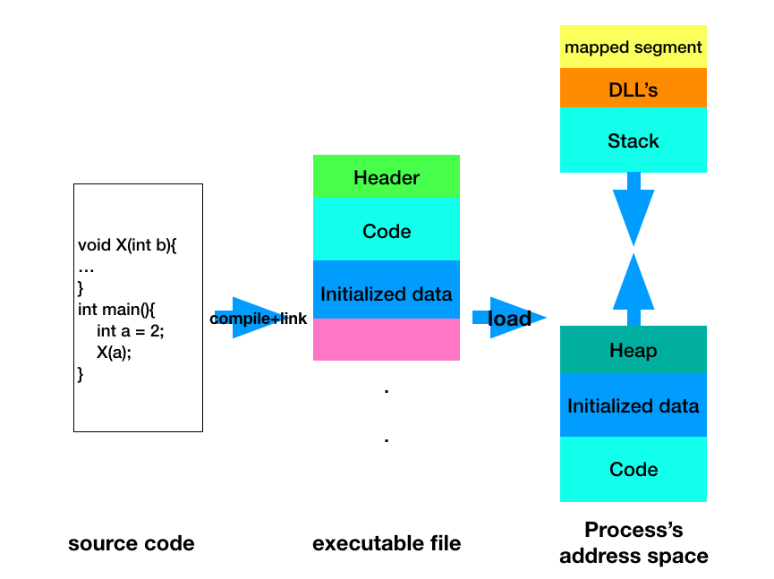
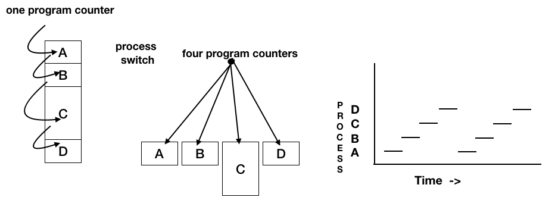
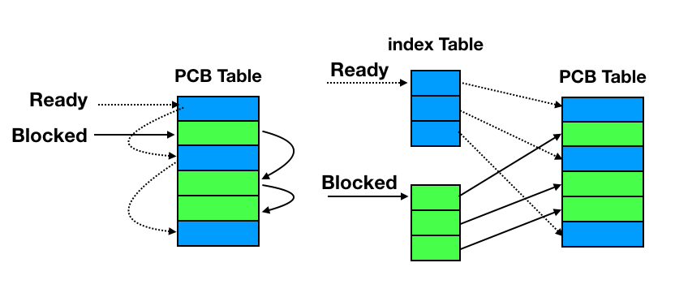

# 7.1 进程的定义
+ 进程（process）的描述
+ 进程的状态(status)
+ 线程(thread)
+ 进程间的通信（inter-process communication）
+ 死锁（deadlock）

## 进程的描述

+ 进程的定义
  - MAC 中使用activity monitor 查看进程
  - 为什么要使用进程？：随着硬件的发展，内存中可以放置多个运行的程序->进程
  - **进程**： 一个具有独立功能的程序在一个数据集合上的一次**动态**执行过程
  - 
+ 进程的组成
+ 进程的特点
+ 进程的控制结构

# 7.2 进程的组成
## 一个进程应该包括：
+ 程序的代码
+ 程序处理的数据
+ 程序计数器中的值，指示下一条将运行的指令
+ 一组通用的寄存器的当前值，堆、栈；
+ 一组系统资源（如打开的文件）
总之，进程包括了正在运行的一个程序的所有状态信息

## 进程与程序的关系
+ 程序是产生进程的基础
+ 程序的每次运行构成不同的进程
+ 进程是程序功能的体现
+ 通过多次执行，一个程序可以对应多个进程，
+ 通过调用关系，一个进程可以包括多个程序
**多对多**的复杂关系
## 进程与程序的区别
+ 进程是动态的，程序是静态的：
  - 程序是有序代码的集合
  - 进程是程序的执行，进程有核心态/用户态
  - 进程是暂时的，程序是永久的：进程是一个状态变化的过程，程序可以长久保存
  - 进程与程序的组成不同： 进程的组成包括程序、数据和进程控制块（即进程状态信息）
+ 类比1： 一个计算机科学家想给女儿做蛋糕，所以找了一本有关蛋糕的食谱，买了一些原料（面粉，鸡蛋，糖，香料。。。），然后边学边做
  - 食谱：程序
  - 你： cpu
  - 原料： 数据
  - 做蛋糕（的过程）： 进程
  这个时候儿子哭着跑进来，说手被蜜蜂蛰了。教授只好把蛋糕放在一边。他在食谱上做了个标记，把状态信息记录了下来。
  然后又去找了一本医疗手册，查到相关的内容，按照上面的指令一步步地执行。当伤口处理完了之后，又回到厨房继续做蛋糕。
  
  **CPU从一个进程（做蛋糕）切换到另一个进程（医疗救护）**
  
 # 7.3 进程的特点
 + 动态性： 可动态的创建，结束进程
 + 并发性： 进程可以被独立调度并占用处理机运行 
  - 并发： 一个时间段多个进程执行
  - 并行： 一个时间点多个进程执行
 + 独立性： 不同进程的工作不相互影响（内存管理：不同的进程分配不同的页表）
 + 制约性： 因访问共享数据/资源或进程间同步而产生制约
 
 
 + 程序 = 算法 + 数据结构
 + 描述进程的数据结构：进程控制块（Process Control Block,PCB）
 + 操作系统为每个进程都维护了一个PCB，用来保护与该进程有关的各种状态信息
 
 # 进程控制结构
 ## 进程控制块：
 + OS管理控制进程运行所用的信息集合
 + OS用PCB来描述进程的基本情况及运行变化的过程
 + PCB是进程存在的唯一标识
 
 ## 使用PCB
 + 进程的创建： 为该进程生成一个PCB
 + 进程的终止： 回收他的PCB
 + 进程的组织管理： 通过对PCB的组织管理来实现
 
 ## PCB包含三大类信息
 + 进程标识信息
  - 本进程的标识
  - 本进程的产生者（父进程）标志
  - 用户标识
 + 处理机状态信息保存区（保存进程的运行现场信息）
  - 用户可见寄存器（用户程序可以使用的数据，地址等寄存器）
  - 控制和状态寄存器（如程序计数器PC，程序状态字PSW）
  - 栈指针（过程调用、系统调用、中断处理和返回时需要用到它）
 + 进程控制信息
  - 调度和状态信息（用于OS调度进程并占用处理机使用）
  - 进程间通信信息（为支持进程间的与通信相关的各种标志，信号，信件等，这些信息存在接收方的PCB中）
  - 存储管理信息（包含有指向本进程影像存储空间的数据结构）
  - 进程所用资源（说明由进程打开，使用的系统资源，如打开的文件等）
  - 有关数据结构连接信息（进程可以连接到一个进程列队中，或者连接到相关的其他进程的PCB）
  
 ## PCB的组织方式
 + 链表： 同一状态的进程其PCB成一个链表，多个状态对应多个不同的链表
  - 就绪链表
  - 阻塞链表
  - 等等
 + 索引表（数组）：同一状态的进程归入一个index表（由index指向PCB），多个状态对应多个不同的index表
  - 就绪索引表
  - 阻塞索引表
  - 等等
  
  
# 7.5 进程的生命期管理
## 进程状态
+ 进程的生命周期管理
  - 进程创建（初始化PCB）
    + 引起进程创建的3个主要事件
      - 系统初始化时（init进程）
      - 用户请求创建一个新的进程
      - 正在运行的进程执行了创建进程的系统调用
  - 进程运行
    + kernel选择一个就绪
  - 进程等待
  - 进程唤醒
  - 京城结束
+ 进程状态变化模型
+ 进程挂起模型

 
